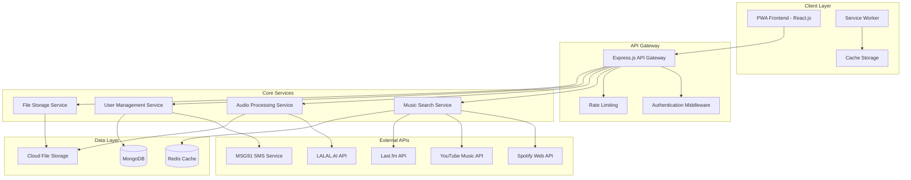
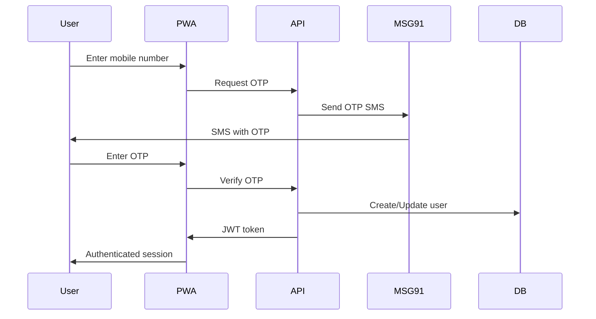

# Melody Studio - Technical Architecture

## Project Overview
A Progressive Web Application that allows users to search for songs in any language, play them, convert them to instrumental versions using AI-based vocal separation, and save them for later playback. The app includes mobile OTP authentication targeting Indian users.

## System Architecture



## Technology Stack

### Frontend (PWA)
- **Framework**: React.js 18+ with TypeScript
- **State Management**: Redux Toolkit + RTK Query
- **UI Library**: Material-UI (MUI) or Chakra UI
- **Audio Playback**: Web Audio API + Howler.js
- **PWA Features**: Workbox for service worker management
- **Build Tool**: Vite for fast development and optimized builds

### Backend
- **Runtime**: Node.js 18+ with TypeScript
- **Framework**: Express.js with Helmet for security
- **Authentication**: JWT tokens + OTP verification
- **File Upload**: Multer with cloud storage integration
- **API Documentation**: Swagger/OpenAPI 3.0

### Database & Storage
- **Primary Database**: MongoDB with Mongoose ODM
- **Caching**: Redis for session management and API caching
- **File Storage**: AWS S3 or Google Cloud Storage for audio files
- **Search Engine**: MongoDB Atlas Search for music metadata

### External Integrations
- **Music APIs**: 
  - Spotify Web API (primary search)
  - YouTube Music API (fallback + streaming)
  - Last.fm API (metadata enrichment)
- **AI Audio Processing**: LALAL.AI API for vocal separation
- **SMS Service**: MSG91 for OTP delivery
- **CDN**: CloudFlare for global content delivery

## Core Features Architecture

### 1. User Authentication Flow


### 2. Music Search & Discovery
- **Multi-API Aggregation**: Search across Spotify, YouTube Music, and Last.fm
- **Language Detection**: Automatic language identification for search results
- **Metadata Enrichment**: Combine data from multiple sources for comprehensive info
- **Caching Strategy**: Redis caching for popular searches and metadata

### 3. Audio Processing Pipeline


### 4. Offline Functionality
- **Service Worker**: Cache API responses and audio files
- **Background Sync**: Queue actions when offline, sync when online
- **Progressive Enhancement**: Core features work offline, enhanced features online

## Database Schema

### Users Collection
```javascript
{
  _id: ObjectId,
  phoneNumber: String, // Primary identifier
  countryCode: String,
  isVerified: Boolean,
  profile: {
    name: String,
    avatar: String,
    preferences: {
      languages: [String],
      genres: [String]
    }
  },
  createdAt: Date,
  lastLoginAt: Date
}
```

### Songs Collection
```javascript
{
  _id: ObjectId,
  title: String,
  artist: String,
  album: String,
  language: String,
  genre: [String],
  duration: Number,
  externalIds: {
    spotify: String,
    youtube: String,
    lastfm: String
  },
  audioFiles: {
    original: String, // URL to original audio
    instrumental: String, // URL to instrumental version
  },
  metadata: {
    releaseYear: Number,
    popularity: Number,
    explicit: Boolean
  },
  createdAt: Date
}
```

### UserLibrary Collection
```javascript
{
  _id: ObjectId,
  userId: ObjectId,
  songId: ObjectId,
  addedAt: Date,
  playCount: Number,
  lastPlayedAt: Date,
  hasInstrumental: Boolean,
  instrumentalStatus: String // 'pending', 'processing', 'completed', 'failed'
}
```

## Security Considerations

### Authentication & Authorization
- JWT tokens with short expiration (15 minutes) + refresh tokens
- Rate limiting on OTP requests (max 3 per hour per phone number)
- Phone number validation and sanitization
- CORS configuration for PWA domains only

### Data Protection
- Encrypt sensitive user data at rest
- HTTPS enforcement for all communications
- Input validation and sanitization
- SQL injection prevention (using ODM)

### API Security
- API key rotation for external services
- Request signing for sensitive operations
- File upload restrictions (type, size, scan for malware)
- DDoS protection via CloudFlare

## Performance Optimization

### Frontend
- Code splitting by routes and features
- Lazy loading of audio components
- Virtual scrolling for large song lists
- Image optimization and lazy loading
- Service worker caching strategies

### Backend
- Database indexing on frequently queried fields
- Redis caching for API responses
- Connection pooling for database
- Compression middleware for API responses
- CDN for static assets and audio files

### Audio Processing
- Queue-based processing for instrumental conversion
- Progress tracking and user notifications
- Batch processing for multiple requests
- Fallback mechanisms for API failures

## Deployment Architecture

### Development Environment
- Docker containers for consistent development
- Hot reloading for frontend and backend
- Local MongoDB and Redis instances
- Mock external APIs for testing

### Production Environment
- **Frontend**: Deployed on Vercel or Netlify with CDN
- **Backend**: Deployed on AWS ECS or Google Cloud Run
- **Database**: MongoDB Atlas with replica sets
- **Cache**: Redis Cloud or AWS ElastiCache
- **File Storage**: AWS S3 with CloudFront CDN
- **Monitoring**: DataDog or New Relic for APM

## Scalability Considerations

### Horizontal Scaling
- Stateless backend services for easy scaling
- Load balancing across multiple API instances
- Database sharding by user regions
- Microservices architecture for independent scaling

### Caching Strategy
- Multi-level caching (browser, CDN, Redis, database)
- Cache invalidation strategies
- Preloading popular content
- Edge caching for global users

## Development Phases

### Phase 1: MVP (4-6 weeks)
- Basic PWA setup with authentication
- Music search integration (Spotify API)
- Simple audio playback
- User library management

### Phase 2: Enhanced Features (3-4 weeks)
- Instrumental conversion integration
- Multiple music API support
- Offline functionality
- Push notifications

### Phase 3: Optimization & Polish (2-3 weeks)
- Performance optimization
- Advanced caching
- Analytics integration
- User experience improvements

## Monitoring & Analytics

### Application Monitoring
- Error tracking with Sentry
- Performance monitoring with Web Vitals
- API response time tracking
- User behavior analytics

### Business Metrics
- User registration and retention rates
- Song search and play statistics
- Instrumental conversion usage
- Popular languages and genres

This architecture provides a solid foundation for building a scalable, performant, and user-friendly multilingual music PWA with advanced features like AI-powered vocal separation and robust authentication.