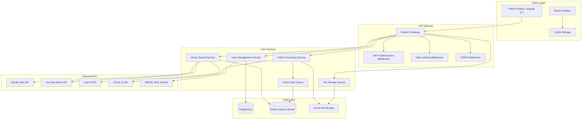
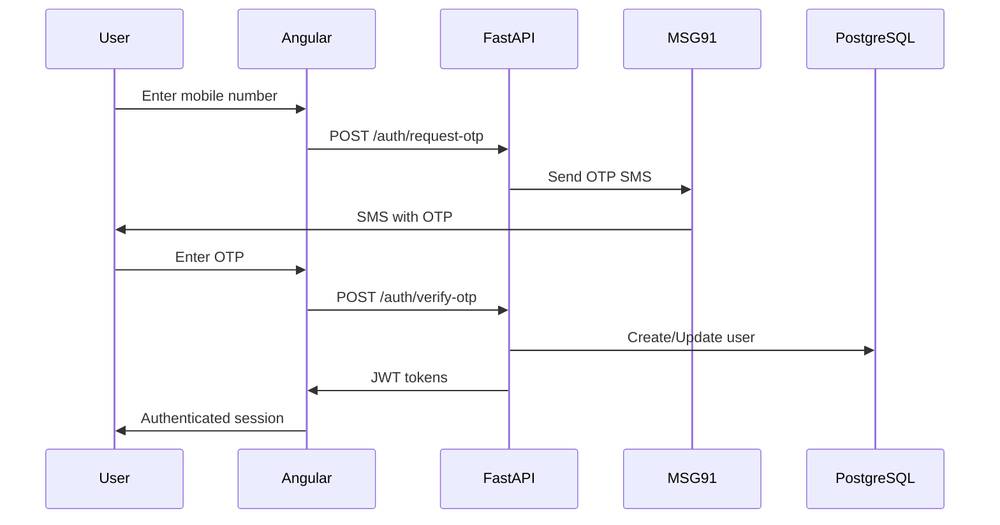
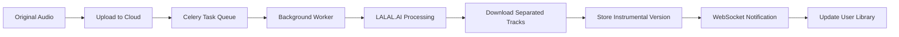

# Melody Studio - Python + Angular Architecture

## Project Overview
A Progressive Web Application that allows users to search for songs in any language, play them, convert them to instrumental versions using AI-based vocal separation, and save them for later playback. The app includes mobile OTP authentication targeting Indian users.

**Technology Migration**: Node.js + React → Python + Angular

## System Architecture



## Technology Stack

### Backend (Python)
- **Framework**: FastAPI 0.104+ with async/await support
- **ORM**: SQLAlchemy 2.0+ with async support
- **Database**: PostgreSQL 15+ for primary data
- **Cache & Message Broker**: Redis 7+ for caching and Celery tasks
- **Task Queue**: Celery 5+ for background audio processing
- **Authentication**: python-jose for JWT tokens + OTP verification
- **File Upload**: python-multipart with cloud storage integration
- **API Documentation**: FastAPI automatic OpenAPI 3.0 generation
- **Validation**: Pydantic v2 for request/response validation
- **HTTP Client**: httpx for async external API calls

### Frontend (Angular)
- **Framework**: Angular 17+ with standalone components
- **State Management**: NgRx 17+ with ComponentStore for local state
- **UI Library**: Angular Material 17+ with CDK
- **Audio Playback**: Web Audio API + Howler.js
- **PWA Features**: Angular Service Worker
- **Build Tool**: Angular CLI with esbuild
- **HTTP Client**: Angular HttpClient with interceptors
- **Forms**: Angular Reactive Forms with validation

### Database & Storage
- **Primary Database**: PostgreSQL 15+ with async SQLAlchemy
- **Caching**: Redis 7+ for session management and API caching
- **File Storage**: AWS S3 or Google Cloud Storage for audio files
- **Search Engine**: PostgreSQL Full-Text Search with GIN indexes
- **Migrations**: Alembic for database schema management

### External Integrations
- **Music APIs**: 
  - Spotify Web API (primary search)
  - YouTube Music API (fallback + streaming)
  - Last.fm API (metadata enrichment)
- **AI Audio Processing**: LALAL.AI API for vocal separation
- **SMS Service**: MSG91 for OTP delivery
- **CDN**: CloudFlare for global content delivery

## Core Features Architecture

### 1. User Authentication Flow


### 2. Music Search & Discovery
- **Multi-API Aggregation**: Async search across Spotify, YouTube Music, and Last.fm
- **Language Detection**: Automatic language identification using langdetect
- **Metadata Enrichment**: Combine data from multiple sources
- **Caching Strategy**: Redis caching with TTL for popular searches
- **Search Optimization**: PostgreSQL full-text search for local metadata

### 3. Audio Processing Pipeline


### 4. Real-time Features
- **WebSocket Server**: FastAPI WebSocket support for real-time updates
- **Task Progress**: Celery task progress tracking via WebSocket
- **Push Notifications**: Angular Service Worker for push notifications
- **Offline Sync**: Angular Service Worker with background sync

## Database Schema (PostgreSQL)

### Users Table
```sql
CREATE TABLE users (
    id UUID PRIMARY KEY DEFAULT gen_random_uuid(),
    phone_number VARCHAR(15) NOT NULL UNIQUE,
    country_code VARCHAR(5) NOT NULL,
    is_verified BOOLEAN DEFAULT FALSE,
    name VARCHAR(255),
    avatar_url TEXT,
    preferences JSONB DEFAULT '{}',
    created_at TIMESTAMP WITH TIME ZONE DEFAULT NOW(),
    updated_at TIMESTAMP WITH TIME ZONE DEFAULT NOW(),
    last_login_at TIMESTAMP WITH TIME ZONE
);

CREATE INDEX idx_users_phone ON users(phone_number);
CREATE INDEX idx_users_created_at ON users(created_at);
```

### Songs Table
```sql
CREATE TABLE songs (
    id UUID PRIMARY KEY DEFAULT gen_random_uuid(),
    title VARCHAR(500) NOT NULL,
    artist VARCHAR(500) NOT NULL,
    album VARCHAR(500),
    language VARCHAR(10),
    duration INTEGER, -- in seconds
    genre TEXT[], -- array of genres
    release_year INTEGER,
    popularity INTEGER DEFAULT 0,
    explicit BOOLEAN DEFAULT FALSE,
    thumbnail_url TEXT,
    external_ids JSONB DEFAULT '{}', -- spotify, youtube, lastfm IDs
    audio_files JSONB DEFAULT '{}', -- original and instrumental URLs
    metadata JSONB DEFAULT '{}', -- additional metadata
    search_vector tsvector, -- for full-text search
    created_at TIMESTAMP WITH TIME ZONE DEFAULT NOW(),
    updated_at TIMESTAMP WITH TIME ZONE DEFAULT NOW()
);

CREATE INDEX idx_songs_title ON songs USING GIN(to_tsvector('english', title));
CREATE INDEX idx_songs_artist ON songs USING GIN(to_tsvector('english', artist));
CREATE INDEX idx_songs_search_vector ON songs USING GIN(search_vector);
CREATE INDEX idx_songs_language ON songs(language);
CREATE INDEX idx_songs_popularity ON songs(popularity DESC);
```

### User Library Table
```sql
CREATE TABLE user_library (
    id UUID PRIMARY KEY DEFAULT gen_random_uuid(),
    user_id UUID NOT NULL REFERENCES users(id) ON DELETE CASCADE,
    song_id UUID NOT NULL REFERENCES songs(id) ON DELETE CASCADE,
    added_at TIMESTAMP WITH TIME ZONE DEFAULT NOW(),
    play_count INTEGER DEFAULT 0,
    last_played_at TIMESTAMP WITH TIME ZONE,
    has_instrumental BOOLEAN DEFAULT FALSE,
    instrumental_status VARCHAR(20) DEFAULT 'none', -- 'none', 'pending', 'processing', 'completed', 'failed'
    instrumental_url TEXT,
    UNIQUE(user_id, song_id)
);

CREATE INDEX idx_user_library_user_id ON user_library(user_id);
CREATE INDEX idx_user_library_added_at ON user_library(added_at DESC);
CREATE INDEX idx_user_library_play_count ON user_library(play_count DESC);
```

### Conversion Jobs Table
```sql
CREATE TABLE conversion_jobs (
    id UUID PRIMARY KEY DEFAULT gen_random_uuid(),
    user_id UUID NOT NULL REFERENCES users(id) ON DELETE CASCADE,
    library_id UUID NOT NULL REFERENCES user_library(id) ON DELETE CASCADE,
    celery_task_id VARCHAR(255) UNIQUE,
    status VARCHAR(20) DEFAULT 'queued', -- 'queued', 'processing', 'completed', 'failed', 'cancelled'
    progress INTEGER DEFAULT 0, -- 0-100
    error_message TEXT,
    original_audio_url TEXT NOT NULL,
    instrumental_audio_url TEXT,
    estimated_time INTEGER, -- in seconds
    started_at TIMESTAMP WITH TIME ZONE,
    completed_at TIMESTAMP WITH TIME ZONE,
    created_at TIMESTAMP WITH TIME ZONE DEFAULT NOW()
);

CREATE INDEX idx_conversion_jobs_user_id ON conversion_jobs(user_id);
CREATE INDEX idx_conversion_jobs_status ON conversion_jobs(status);
CREATE INDEX idx_conversion_jobs_celery_task_id ON conversion_jobs(celery_task_id);
```

## API Structure (FastAPI)

### Project Structure
```python
# FastAPI app structure
from fastapi import FastAPI, Depends, HTTPException
from fastapi.middleware.cors import CORSMiddleware
from fastapi.middleware.trustedhost import TrustedHostMiddleware
from fastapi.security import HTTPBearer
import uvicorn

app = FastAPI(
    title="Melody Studio API",
    description="Music streaming and instrumental conversion API",
    version="2.0.0",
    docs_url="/docs",
    redoc_url="/redoc"
)

# Middleware
app.add_middleware(CORSMiddleware, allow_origins=["*"])
app.add_middleware(TrustedHostMiddleware, allowed_hosts=["*"])

# Routes
from routers import auth, music, library, audio, users, system
app.include_router(auth.router, prefix="/api/v1/auth", tags=["Authentication"])
app.include_router(music.router, prefix="/api/v1/music", tags=["Music"])
app.include_router(library.router, prefix="/api/v1/library", tags=["Library"])
app.include_router(audio.router, prefix="/api/v1/audio", tags=["Audio Processing"])
app.include_router(users.router, prefix="/api/v1/users", tags=["Users"])
app.include_router(system.router, prefix="/api/v1/system", tags=["System"])
```

### Key API Endpoints
```python
# Authentication endpoints
@router.post("/request-otp")
async def request_otp(request: OTPRequest) -> OTPResponse

@router.post("/verify-otp")
async def verify_otp(request: OTPVerification) -> AuthResponse

@router.post("/refresh-token")
async def refresh_token(request: RefreshTokenRequest) -> TokenResponse

# Music search endpoints
@router.get("/search")
async def search_music(
    q: str,
    limit: int = 20,
    offset: int = 0,
    language: Optional[str] = None,
    source: Optional[str] = "all"
) -> SearchResponse

@router.get("/track/{track_id}")
async def get_track_details(track_id: UUID) -> TrackResponse

@router.get("/trending")
async def get_trending_tracks(
    language: Optional[str] = None,
    limit: int = 20,
    timeframe: str = "weekly"
) -> TrendingResponse

# Audio processing endpoints
@router.post("/convert-to-instrumental")
async def convert_to_instrumental(
    request: ConversionRequest,
    current_user: User = Depends(get_current_user)
) -> ConversionJobResponse

@router.get("/conversion-status/{job_id}")
async def get_conversion_status(
    job_id: UUID,
    current_user: User = Depends(get_current_user)
) -> ConversionStatusResponse
```

## Angular Frontend Architecture

### Project Structure
```typescript
// Angular 17+ with standalone components
import { bootstrapApplication } from '@angular/platform-browser';
import { provideRouter } from '@angular/router';
import { provideHttpClient, withInterceptors } from '@angular/common/http';
import { provideServiceWorker } from '@angular/service-worker';
import { provideStore } from '@ngrx/store';

import { AppComponent } from './app/app.component';
import { routes } from './app/app.routes';
import { authInterceptor } from './app/core/interceptors/auth.interceptor';

bootstrapApplication(AppComponent, {
  providers: [
    provideRouter(routes),
    provideHttpClient(withInterceptors([authInterceptor])),
    provideServiceWorker('ngsw-worker.js'),
    provideStore(reducers),
    // ... other providers
  ]
});
```

### Key Components
```typescript
// Standalone components structure
@Component({
  selector: 'app-music-search',
  standalone: true,
  imports: [CommonModule, ReactiveFormsModule, MatInputModule],
  template: `...`,
  styleUrls: ['./music-search.component.scss']
})
export class MusicSearchComponent {
  searchForm = this.fb.group({
    query: ['', Validators.required],
    language: [''],
    source: ['all']
  });

  constructor(
    private fb: FormBuilder,
    private musicService: MusicService,
    private store: Store
  ) {}
}

// Audio player service
@Injectable({ providedIn: 'root' })
export class AudioPlayerService {
  private audioContext: AudioContext;
  private currentTrack$ = new BehaviorSubject<Track | null>(null);
  private isPlaying$ = new BehaviorSubject<boolean>(false);

  constructor() {
    this.audioContext = new AudioContext();
  }

  async playTrack(track: Track): Promise<void> {
    // Web Audio API implementation
  }

  pauseTrack(): void {
    // Pause implementation
  }
}
```

### State Management (NgRx)
```typescript
// Feature state
export interface MusicState {
  searchResults: Track[];
  currentTrack: Track | null;
  isPlaying: boolean;
  volume: number;
  queue: Track[];
  loading: boolean;
  error: string | null;
}

// Actions
export const searchMusic = createAction(
  '[Music] Search Music',
  props<{ query: string; filters: SearchFilters }>()
);

export const searchMusicSuccess = createAction(
  '[Music] Search Music Success',
  props<{ results: Track[] }>()
);

// Effects
@Injectable()
export class MusicEffects {
  searchMusic$ = createEffect(() =>
    this.actions$.pipe(
      ofType(searchMusic),
      switchMap(({ query, filters }) =>
        this.musicService.searchMusic(query, filters).pipe(
          map(results => searchMusicSuccess({ results })),
          catchError(error => of(searchMusicFailure({ error })))
        )
      )
    )
  );

  constructor(
    private actions$: Actions,
    private musicService: MusicService
  ) {}
}
```

## Security Considerations

### Backend Security (FastAPI)
- **JWT Authentication**: python-jose with RS256 algorithm
- **Rate Limiting**: slowapi (FastAPI port of Flask-Limiter)
- **Input Validation**: Pydantic models with strict validation
- **CORS**: Configured for specific origins only
- **SQL Injection Prevention**: SQLAlchemy ORM with parameterized queries
- **Password Hashing**: bcrypt for sensitive data encryption

### Frontend Security (Angular)
- **XSS Protection**: Angular's built-in sanitization
- **CSRF Protection**: Angular HttpClient CSRF tokens
- **Content Security Policy**: Strict CSP headers
- **Secure Storage**: Encrypted localStorage for sensitive data
- **HTTP Interceptors**: Automatic token attachment and refresh

## Performance Optimization

### Backend Performance
- **Async/Await**: FastAPI with async database operations
- **Connection Pooling**: SQLAlchemy async engine with pool
- **Caching**: Redis with TTL for frequently accessed data
- **Background Tasks**: Celery for heavy operations
- **Database Indexing**: Optimized indexes for common queries
- **Response Compression**: gzip compression middleware

### Frontend Performance
- **Lazy Loading**: Route-based code splitting
- **OnPush Change Detection**: Optimized change detection strategy
- **Virtual Scrolling**: Angular CDK virtual scrolling for large lists
- **Service Worker**: Aggressive caching for static assets
- **Bundle Optimization**: Tree shaking and dead code elimination
- **Image Optimization**: WebP format with fallbacks

### Audio Processing Optimization
- **Queue Management**: Celery with Redis broker for task distribution
- **Progress Tracking**: Real-time progress updates via WebSocket
- **Batch Processing**: Multiple file processing optimization
- **CDN Integration**: CloudFlare for audio file delivery
- **Compression**: Audio file compression for faster delivery

## Deployment Architecture

### Development Environment
- **Docker Compose**: Multi-container development setup
- **Hot Reloading**: FastAPI auto-reload + Angular dev server
- **Local Databases**: PostgreSQL and Redis containers
- **Mock Services**: Local mocks for external APIs

### Production Environment
- **Backend**: Docker containers on AWS ECS or Google Cloud Run
- **Frontend**: Angular build deployed on Vercel or Netlify
- **Database**: Managed PostgreSQL (AWS RDS or Google Cloud SQL)
- **Cache**: Redis Cloud or AWS ElastiCache
- **File Storage**: AWS S3 with CloudFront CDN
- **Task Queue**: Celery workers on separate containers
- **Monitoring**: Sentry for error tracking, DataDog for metrics

## Migration Benefits

### Why Python + Angular?

#### Python Backend Advantages:
1. **Better AI/ML Integration**: Native support for audio processing libraries
2. **Async Performance**: FastAPI rivals Node.js performance
3. **Type Safety**: Strong typing with Pydantic and type hints
4. **Rich Ecosystem**: Extensive libraries for audio processing
5. **Scalability**: Better handling of CPU-intensive tasks
6. **Maintainability**: More readable and maintainable code

#### Angular Frontend Advantages:
1. **Enterprise-Ready**: Better for large-scale applications
2. **Type Safety**: Full TypeScript integration
3. **Dependency Injection**: Better service architecture
4. **Testing**: Comprehensive testing framework
5. **PWA Support**: Excellent service worker integration
6. **Performance**: Better change detection and optimization

## Development Phases

### Phase 1: Foundation (Weeks 1-3)
- Set up FastAPI backend with PostgreSQL
- Create Angular 17+ frontend with standalone components
- Implement JWT authentication with OTP
- Set up Celery for background tasks

### Phase 2: Core Features (Weeks 4-7)
- Multi-platform music search integration
- Audio player implementation with Web Audio API
- User library management
- Real-time WebSocket communication

### Phase 3: Advanced Features (Weeks 8-10)
- AI audio processing with Celery tasks
- PWA features with Angular Service Worker
- Push notifications and offline support
- Performance optimization

### Phase 4: Production (Weeks 11-12)
- Security hardening and testing
- Deployment setup and monitoring
- Load testing and optimization
- Documentation and launch preparation

This architecture provides a modern, scalable, and maintainable foundation for Melody Studio using Python and Angular, with significant improvements in performance, type safety, and developer experience.