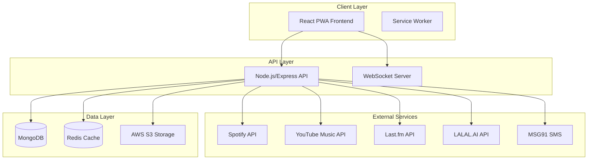

# Melody Studio 🎵

A Progressive Web Application for searching, playing, and converting songs from any language to instrumental versions using AI-powered vocal separation.

## 🚀 Features

- **🔍 Multi-Language Music Search**: Search for songs in any language using Spotify, YouTube Music, and Last.fm APIs
- **🎧 High-Quality Audio Playback**: Web Audio API-powered player with advanced controls
- **🤖 AI Instrumental Conversion**: Convert any song to instrumental version using LALAL.AI
- **📱 Progressive Web App**: Works seamlessly on mobile and desktop with offline support
- **🔐 Secure Authentication**: Mobile OTP authentication via MSG91 for Indian users
- **💾 Personal Library**: Save and organize your favorite songs and instrumentals
- **🔄 Real-time Updates**: Live progress tracking for conversions and notifications
- **⚡ Offline Support**: Core features work without internet connection

## 🏗️ Architecture Overview



## 🛠️ Technology Stack

### Frontend
- **React 18+** with TypeScript
- **Redux Toolkit** + RTK Query for state management
- **Material-UI** for component library
- **Vite** for build tooling
- **Workbox** for PWA features

### Backend
- **Node.js 18+** with TypeScript
- **Express.js** for API server
- **MongoDB** with Mongoose ODM
- **Redis** for caching and sessions
- **WebSocket** for real-time features

### External Integrations
- **Spotify Web API** - Primary music search
- **YouTube Music API** - Fallback and streaming
- **Last.fm API** - Metadata enrichment
- **LALAL.AI API** - AI vocal separation
- **MSG91** - SMS OTP service

### Infrastructure
- **AWS S3** - Audio file storage
- **CloudFlare** - CDN and DDoS protection
- **Docker** - Containerization
- **GitHub Actions** - CI/CD pipeline

## 📁 Project Structure

```
melody_studio/
├── frontend/          # React PWA application
├── backend/           # Node.js API server
├── shared/            # Shared types and utilities
├── docs/              # Documentation
├── scripts/           # Build and deployment scripts
├── infrastructure/    # Docker and deployment configs
└── README.md
```

## 🚀 Quick Start

### Prerequisites
- Node.js 18+
- Docker and Docker Compose
- MongoDB and Redis (or use Docker)

### Development Setup

1. **Clone the repository**
   ```bash
   git clone <repository-url>
   cd melody_studio
   ```

2. **Install dependencies**
   ```bash
   npm install
   ```

3. **Set up environment variables**
   ```bash
   cp .env.example .env
   # Edit .env with your API keys and configuration
   ```

4. **Start development services**
   ```bash
   # Start all services with Docker
   npm run docker:up
   
   # Start development servers
   npm run dev
   ```

5. **Access the application**
   - Frontend: http://localhost:3000
   - Backend API: http://localhost:3001
   - API Documentation: http://localhost:3001/docs

## 📋 Development Roadmap

### Phase 1: Foundation (Weeks 1-3)
- ✅ Project setup and development environment
- ✅ User authentication with OTP
- ✅ Basic PWA structure

### Phase 2: Core Features (Weeks 4-7)
- 🔄 Multi-platform music search
- 🔄 Audio playback system
- 🔄 Search interface and UX

### Phase 3: Advanced Features (Weeks 8-10)
- ⏳ User library management
- ⏳ AI instrumental conversion
- ⏳ Background processing pipeline

### Phase 4: PWA & Polish (Weeks 11-12)
- ⏳ Offline functionality
- ⏳ Push notifications
- ⏳ Mobile optimization

### Phase 5: Production (Weeks 13-14)
- ⏳ Security hardening
- ⏳ Performance optimization
- ⏳ Deployment and monitoring

## 🔧 API Documentation

The API follows RESTful conventions with comprehensive documentation available at `/docs` endpoint.

### Key Endpoints
- `POST /auth/request-otp` - Request OTP for authentication
- `GET /music/search` - Search for songs across platforms
- `POST /library/songs` - Add song to user library
- `POST /audio/convert-to-instrumental` - Request instrumental conversion
- `GET /user/profile` - Get user profile and preferences

See [API_SPECIFICATION.md](./API_SPECIFICATION.md) for complete documentation.

## 🏛️ Architecture Details

### System Design
- **Microservices Architecture**: Modular services for scalability
- **Event-Driven Processing**: Background jobs for audio conversion
- **Multi-Level Caching**: Browser, CDN, Redis, and database caching
- **Progressive Enhancement**: Core features work offline

### Security Features
- JWT-based authentication with refresh tokens
- Rate limiting and DDoS protection
- Input validation and sanitization
- HTTPS enforcement and security headers

### Performance Optimizations
- Code splitting and lazy loading
- Service worker caching strategies
- CDN for static assets and audio files
- Database indexing and query optimization

## 🧪 Testing

```bash
# Run all tests
npm run test

# Run backend tests
npm run test:backend

# Run frontend tests
npm run test:frontend

# Run e2e tests
npm run test:e2e
```

## 🚀 Deployment

### Development
```bash
npm run docker:build
npm run docker:up
```

### Production
```bash
# Build for production
npm run build

# Deploy to staging
npm run deploy:staging

# Deploy to production
npm run deploy:production
```

## 📊 Monitoring & Analytics

- **Application Monitoring**: Sentry for error tracking
- **Performance Monitoring**: Web Vitals and Core Web Vitals
- **User Analytics**: Custom analytics for user behavior
- **Infrastructure Monitoring**: DataDog for system metrics

## 🤝 Contributing

1. Fork the repository
2. Create a feature branch (`git checkout -b feature/amazing-feature`)
3. Commit your changes (`git commit -m 'Add amazing feature'`)
4. Push to the branch (`git push origin feature/amazing-feature`)
5. Open a Pull Request

## 📄 License

This project is licensed under the MIT License - see the [LICENSE](LICENSE) file for details.

## 🙏 Acknowledgments

- **Spotify** for music search API
- **YouTube** for music streaming capabilities
- **LALAL.AI** for AI-powered vocal separation
- **MSG91** for SMS OTP services
- **Open Source Community** for amazing tools and libraries

## 📞 Support

For support and questions:
- 📧 Email: support@melodystudio.com
- 💬 Discord: [Melody Studio Community](https://discord.gg/melodystudio)
- 📖 Documentation: [docs.melodystudio.com](https://docs.melodystudio.com)

---

**Built with ❤️ for music lovers worldwide** 🌍🎵